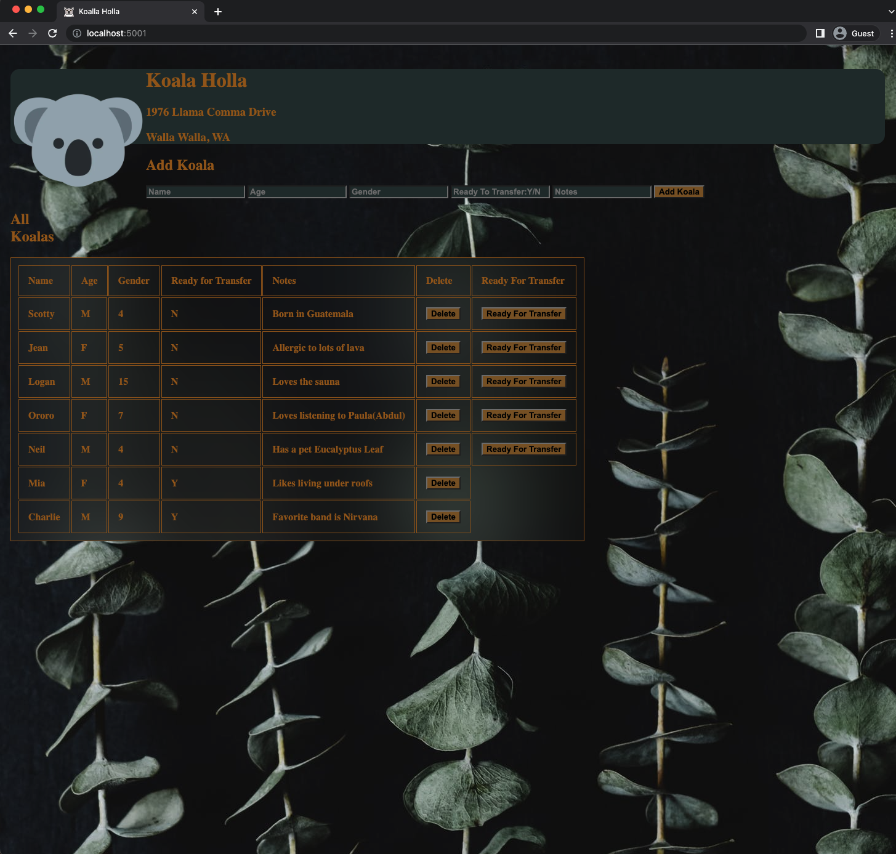

Koala Holla
===========

Our client, Koala Holla (1976 Llama Comma Drive, Walla Walla WA) is a non-profit dedicated to the ethical transitioning of koalas from the outdoors (whereupon they may be rained) to urban areas where roofs exist. Your team has been hired to build a web app to handle their terrarium residents.

Client needs
------------
They need the ability to add a Koala to the database. Make a form with the appropriate info. Save the koala in the database. Think about what data types you'll be needing for your table columns.  

They need the ability for mark a Koala ready for transfer. Each koala in your UI needs a button in that reads 'Ready for Transfer'. When the user clicks on the button, it should update the database for the specific Koala. The 'Ready for Transfer' button should only appear for Koalas that haven't yet been marked ready for transfer.

Technologies
------------
* JQuery
* Node
* Express
* SQL

Final project Looks like this :

